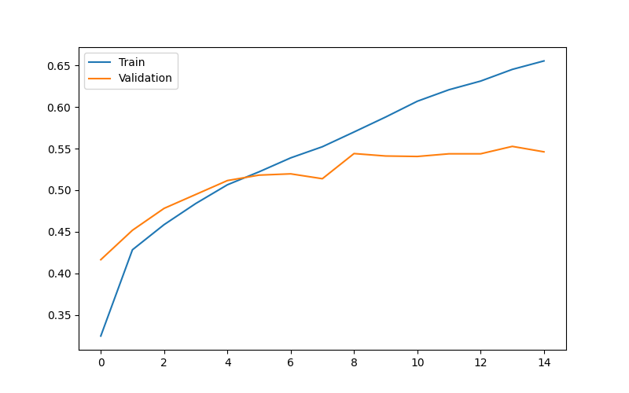
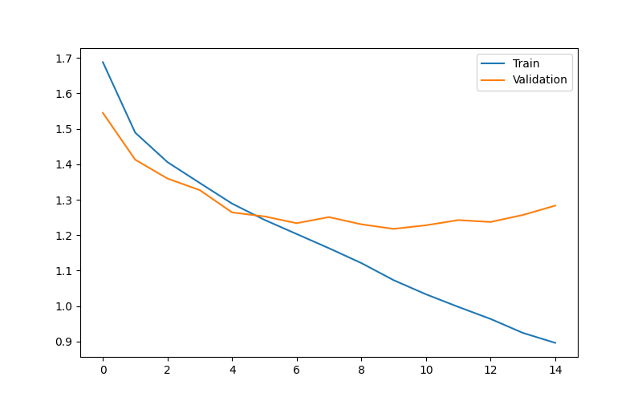

# Human Emotion Detection using CNN and Deep Learning

EmotionAI is a full-stack facial emotion recognition system built with TensorFlow, Flask, React, and OpenCV. It classifies facial expressions into seven emotions and provides an interactive dashboard for model evaluation, prediction analytics, and CNN visualization.

## Project Overview

This project aims to classify facial expressions into seven emotions:

- Angry 😠
- Disgust 🤢
- Fear 😨
- Happy 😄
- Neutral 😐
- Sad 😢
- Surprise 😲

---

## Features

### Deep Learning
- CNN trained on FER-2013
- Seven emotion classification
- OpenCV Haar Cascade face detection
- Confidence scores
- Confusion matrix
- Classification report

### Backend
- Flask REST API
- Multipart image upload
- JSON predictions
- Inference time measurement
- Class probability output

### Frontend
- React + TypeScript
- Modern dark dashboard
- Live prediction interface
- CNN architecture visualization
- Model evaluation page
- Analytics dashboard
- Prediction history
- Interactive charts

---

## Tech Stack

### Frontend
React
TypeScript
TanStack Router
TailwindCSS
Recharts
Axios
Zustand

### Backend
Flask
TensorFlow
OpenCV
NumPy

### ML
TensorFlow/Keras
Scikit-learn
Pandas
Matplotlib
Seaborn

---

## Project Structure

```text
human-emotion-detection/
│
├── assets/
|       ├── baseline_accuracy.png
|       ├── baseline_loss.png
|       ├── improved_accuracy.png
|       ├── improved_loss.png
|       ├── confusion_matrix_v1.png
|       └── confusion_matrix_v2.png
│
├── backend/
│   ├── notebooks/
│   │   ├── 01_dataset_exploration.ipynb
│   │   └── 02_training.ipynb
│   │
│   ├── predict.py
│   ├── face_predict.py
│   └── app.py
│
├── test_images/
│
├── reports/
│   ├── classification_report.txt
│   └── classification_report_v2.txt
│
├── saved_models/
│   |── emotion_model.keras
|   └── emotion_model_v2.keras
│
├── frontend/
│
├── dataset/
│   ├── train/
│   └── test/
│
├── requirements.txt
├── README.md
└── .gitignore
```

---

## Dataset

Dataset used: **FER2013**

Dataset contains grayscale facial images of size:

```text
48 × 48 pixels
```

Number of emotion classes:

```text
7
```

### Download Dataset

Download FER2013 from Kaggle and extract it into:

```text
dataset/
├── train/
└── test/
```

---


## CNN Architecture

```text
Input (48x48x1)
        ↓
Conv2D (32 filters)
        ↓
MaxPooling2D
        ↓
Conv2D (64 filters)
        ↓
MaxPooling2D
        ↓
Flatten
        ↓
Dense (128)
        ↓
Dropout
        ↓
Dense (7)
```

Total trainable parameters:

```text
839,047
```

---

## Model Performance

After training for 15 epochs:

- Training Accuracy: ~61%
- Validation Accuracy: ~53%

The model shows signs of overfitting after approximately 10 epochs, which motivates further improvements using:

- Data Augmentation
- Batch Normalization
- Early Stopping
- Deeper CNN architectures

After training for 30 epochs:

- Baseline CNN Validation Accuracy: 53.4%
- Improved CNN Validation Accuracy: 59.5%

---

## Training Accuracy



---

## Training Loss



---

## Project Status

- [x] CNN model
- [x] Improved CNN
- [x] Flask REST API
- [x] React frontend
- [x] Interactive dashboard
- [x] CNN architecture visualization
- [x] Confusion matrix
- [x] Classification report
- [x] Live image prediction
- [ ] Webcam inference
- [ ] Deployment

---

## Sample Results

### Happy Image
Prediction: Happy (100%)

### Angry Image
Prediction: Angry (64.90%)

### Sad Image
Prediction: Sad (37.29%)

---

## Future Improvements

- Data augmentation
- Transfer learning (ResNet/MobileNet)
- Real-time emotion detection
- Emotion analytics dashboard
- Model deployment

---

## Note:

The trained model is not included due to file size limitations.
It can be reproduced by running 02_training.ipynb.

---

## Evaluation

Validation Accuracy: ~53%

The model performs well on some emotions such as Happy and Angry but struggles on Sad and Neutral expressions due to similarities between these classes and limitations of the FER2013 dataset.

---

## Key Learnings

- Convolutional Neural Networks (CNNs)
- Image preprocessing and normalization
- Data generators in TensorFlow/Keras
- Model evaluation using confusion matrices and classification reports
- Face detection using OpenCV
- Deep learning workflow from training to inference and deployment

---

## Author

Arshpreet Kaur

B.Tech CSE | NIT Delhi

Learning Deep Learning through hands-on projects 🚀